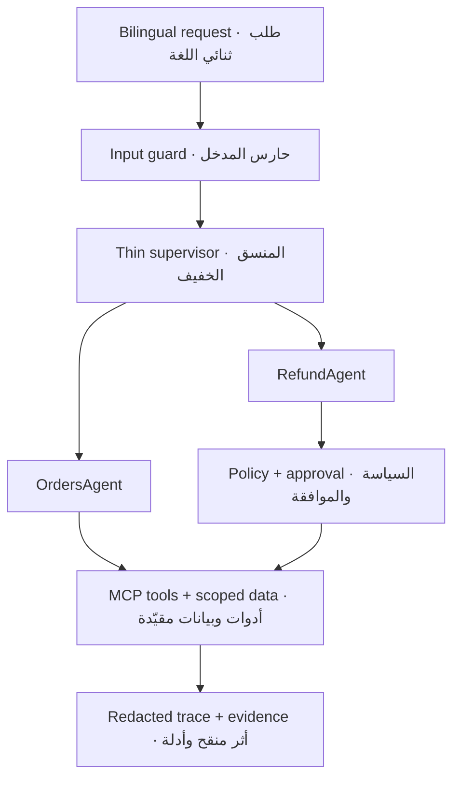

# Rafeeq Mini Labs · لابات رفيق المصغّر

[](CHANGELOG.md)
[](https://colab.research.google.com/github/almiyead-rgb/rafeeq-agentic-ai-labs/blob/main/notebooks/Rafeeq_Mini_Capstone.ipynb)
[](.env.example)

**Rafeeq Mini** is one cumulative, bilingual mini-capstone for the three-day course **Advanced Agentic AI Systems Engineering**. Learners build a safe delivery-support agent in small stages, test every stage, and export an auditable GitHub submission.

**رفيق المصغّر** مشروع تطبيقي تراكمي وثنائي اللغة لدورة **هندسة أنظمة الذكاء الاصطناعي التوكيلي المتقدمة** الممتدة ثلاثة أيام. يبني المتدرب مساعد دعم لعمليات التوصيل على مراحل صغيرة، ويختبر كل مرحلة، ثم يصدّر تسليمًا قابلًا للتدقيق على GitHub.

> Learner pilot `0.9.0-rc1`: locally and CI verified. The mandatory path uses Google Colab Free CPU, `LLM_MODE=stub`, synthetic data, and no API key, GPU, terminal, PAT, or paid service.
>
> نسخة تجريبية للمتدربين `0.9.0-rc1`: جرى التحقق منها محليًا وفي CI. يعمل المسار الإلزامي على Colab المجاني وCPU، بالوضع `LLM_MODE=stub` وبيانات مصطنعة، بلا مفتاح API أو GPU أو طرفية أو PAT أو خدمة مدفوعة.

## Start · ابدأ

| English | العربية |
|---|---|
| 1. Sign in to a personal [GitHub account](https://github.com/signup) and verify your email. | 1. سجّل الدخول إلى [حساب GitHub](https://github.com/signup) شخصي ووثّق بريدك. |
| 2. Create a new empty repository for your work. Do not add secrets or real customer data. | 2. أنشئ مستودعًا فارغًا جديدًا لعملك. لا تضف أسرارًا أو بيانات عملاء حقيقية. |
| 3. Open the cumulative notebook using the button below, then choose **File → Save a copy in Drive**. | 3. افتح الدفتر التراكمي من الزر أدناه، ثم اختر **File → Save a copy in Drive**. |
| 4. Select the standard CPU runtime and run `C0_ENV_DOCTOR`. Success is `C0 = READY`. | 4. اختر بيئة CPU القياسية وشغّل `C0_ENV_DOCTOR`. علامة النجاح هي `C0 = READY`. |
| 5. At each day gate, download the generated evidence. At C29, enable final export and upload the clean files to your repository through the GitHub browser. | 5. عند بوابة كل يوم نزّل الأدلة الناتجة. وفي C29 فعّل التصدير النهائي وارفع الملفات النظيفة إلى مستودعك من متصفح GitHub. |

### [Open Rafeeq Mini in Google Colab · افتح رفيق المصغّر في كولاب](https://colab.research.google.com/github/almiyead-rgb/rafeeq-agentic-ai-labs/blob/main/notebooks/Rafeeq_Mini_Capstone.ipynb)

Detailed beginner instructions are in [the learner guide](docs/learner-guide.md). If the runtime disconnects, follow [the recovery guide](recovery/README.md); you do not need to restart the whole project.

توجد تعليمات المبتدئ المفصلة في [دليل المتدرب](docs/learner-guide.md). وإذا انقطعت بيئة التشغيل، فاتبع [دليل الاستعادة](recovery/README.md)؛ لا تحتاج إلى إعادة المشروع كله.

## Project scenario · سيناريو المشروع

A customer contacts the fictional delivery company **Tawseel** in Arabic or English to ask about an order or request a refund. Rafeeq detects the intent and order ID, verifies ownership through a scoped tool, retrieves only the active policy, delegates to the correct specialist, and records a redacted trace. Refunds require a delay greater than two days; amounts above SAR 500 pause for explicit human approval. Re-running a write remains safe through deterministic idempotency.

يتواصل عميل مع شركة التوصيل الافتراضية **توصيل** بالعربية أو الإنجليزية للسؤال عن طلب أو طلب استرداد. يحدد رفيق النية ورقم الطلب، ويتحقق من الملكية عبر أداة مقيّدة، ويسترجع السياسة السارية فقط، ويفوض المهمة للوكيل المتخصص، ويسجل أثرًا منقحًا. يشترط الاسترداد تأخرًا يزيد على يومين، وتتوقف المبالغ الأعلى من 500 ريال حتى تصدر موافقة بشرية صريحة. وتظل إعادة خلية الكتابة آمنة بفضل مفتاح منع التكرار الحتمي.



## Three-day build · البناء خلال ثلاثة أيام

| Day | Cells | Build outcome · ناتج البناء | Gate · البوابة |
|---|---:|---|---|
| 1 · Core & tools · النواة والأدوات | C0–C9 | Typed state, bounded graph, ReAct, schemas, and a real local MCP `stdio` connection · حالة محددة النوع، مخطط محدود، ReAct، مخططات أدوات، واتصال MCP محلي فعلي | `C9_DAY1_GATE` |
| 2 · Memory & orchestration · الذاكرة والتنسيق | C10–C20 | Session memory, scoped recall, policy retrieval, two specialists, typed delegation, planning, refund gate, and interrupt/resume · ذاكرة جلسية، استرجاع مقيّد، سياسات، وكيلان متخصصان، تفويض، تخطيط، بوابة استرداد، وتوقف/استئناف | `C20_DAY2_GATE` |
| 3 · Security & evidence · الأمن والأدلة | C21–C29 | Threat model, attack suite, guard repair, bounded reflection, traces, one measured optimization, scorecard, readiness, and safe export · نموذج تهديد، اختبارات هجوم، إصلاح الحواجز، انعكاس محدود، آثار، تحسين مقاس واحد، بطاقة نتائج، جاهزية، وتصدير آمن | `C29_EXPORT_SAFETY_CHECK` |

The notebook contains exactly 30 named sections and 14 short learner TODOs. The rest is runnable scaffolding, tests, hints, and evidence generation. Private answer keys, hidden evaluations, grades, and instructor checkpoints are intentionally absent.

يحتوي الدفتر على 30 قسمًا مسمى و14 مهمة قصيرة فقط للمتدرب. أما الباقي فهو بنية تشغيلية واختبارات وتلميحات وتوليد أدلة. لا يتضمن المستودع مفاتيح إجابة أو تقييمات خفية أو درجات أو نقاط استعادة للمدربة.

## Final learner outputs · مخرجات المتدرب النهائية

- Deployable, dependency-light Python package and local MCP server · حزمة Python قابلة للتشغيل وخادم MCP محلي.
- `reports/PROJECT_REPORT.md` · تقرير المشروع.
- `reports/SECURITY_ASSESSMENT.md` · تقرير الأمن وإعادة الاختبار.
- `reports/trace.jsonl` and `reports/assessment_results.json` · أثر منقح ونتائج تقييم.
- `reports/monitoring_dashboard.png` · لوحة مراقبة ثابتة.
- `reports/submission_manifest.json` and a clean submission ZIP · بيان ملفات وحزمة تسليم نظيفة.

## Repository map · خريطة المستودع

| Path | Purpose · الغرض |
|---|---|
| `notebooks/` | Cumulative Colab notebook and cell map · الدفتر التراكمي وخريطة الخلايا |
| `src/rafeeq/` | Typed state, graph, agents, memory, retrieval, guards, tracing, assessment · النواة البرمجية |
| `mcp_server/` | Dependency-free educational MCP `stdio` server · خادم MCP تعليمي بلا اعتماديات |
| `data/public/` | Versioned synthetic learner datasets · بيانات مصطنعة عامة بإصدار محدد |
| `tests/public/` | Learner-visible contract and safety tests · اختبارات العقود والسلامة المرئية |
| `tests/schemas/` | JSON contracts for state, traces, assessment, and export · عقود JSON |
| `scripts/` | Doctor, gates, assessment, demo, validation, and safe export · أدوات التشغيل والتحقق |
| `reports/templates/` | Bilingual evidence and report templates · قوالب التقارير والأدلة |
| `recovery/` | Restart and checkpoint guidance · إرشادات الاستعادة ونقاط الحفظ |
| `docs/` | Bilingual learner portal · بوابة المتدرب الثنائية |

## Local verification · التحقق المحلي

No installation is required for the core verification path:

```bash
python scripts/doctor.py
python -m unittest discover -s tests/public -p "test_*.py" -v
python scripts/validate_notebook.py
python scripts/run_assessment.py
python scripts/validate_release.py
```

لا يحتاج مسار التحقق الأساسي إلى تثبيت. جميع البيانات تعليمية مصطنعة، وجميع عمليات الاسترداد محاكاة لا تنفذ معاملة مالية.

## Safety boundary · حدود السلامة

- Never enter real customer or trainee data, credentials, private links, tokens, or API keys.
- Trusted identity and approval context are attached by the host runtime, never accepted as model-controlled tool arguments.
- Traces store decisions, counters, codes, and short rationale only—never raw prompts or private chain-of-thought.
- Read operations may receive one bounded retry for a transient failure; write operations are never retried automatically.
- Hidden tests, solutions, instructor notes, and real recovery checkpoints belong in a separate private repository—not a branch or tag here.

---

- لا تدخل بيانات حقيقية لعميل أو متدرب، أو بيانات دخول، أو روابط خاصة، أو رموزًا، أو مفاتيح API.
- يضيف المضيف هوية العميل وسياق الموافقة الموثوق، ولا تقبلهما الأدوات ضمن معاملات يسيطر عليها النموذج.
- تسجل الآثار القرارات والعدادات والرموز ومبررًا قصيرًا فقط، ولا تسجل الأمر الخام أو سلسلة التفكير الخاصة.
- قد تعاد عملية القراءة مرة واحدة فقط عند فشل عابر؛ ولا تعاد عملية الكتابة تلقائيًا.
- مكان الاختبارات الخفية والحلول وملاحظات المدربة ونقاط الاستعادة الحقيقية مستودع خاص منفصل، وليس فرعًا أو وسمًا هنا.

## Instructor · المدربة

**Meaad Al-Marri · ميعاد المري**

[SDAIA Academy on GitHub](https://github.com/SDAIAAcademy) is provided only as an external reference. This repository does not use an official logo or claim institutional endorsement, approval, or ownership.

يُعرض رابط [أكاديمية سدايا على GitHub](https://github.com/SDAIAAcademy) بوصفه مرجعًا خارجيًا فقط. لا يستخدم المستودع شعارًا رسميًا ولا يدّعي اعتمادًا أو موافقة أو ملكية مؤسسية.

Educational simulation only · محاكاة تعليمية فقط. All rights reserved pending confirmed publishing authority · جميع الحقوق محفوظة إلى حين تأكيد صلاحية النشر.
